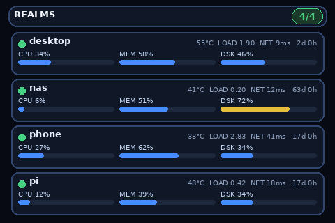

<div align="center">

# turmo-screen

**Dashboard de servidores y sender de medios para pantallas USB de 3.5" TURMO / estilo Turing en Linux**

[](https://github.com/ncorrea-13/turmo-screen/actions/workflows/ci.yml)
[](https://www.python.org)
[](https://github.com/ncorrea-13?tab=packages&repo_name=turmo-screen)
[](#licencia)

[English](README.md)

</div>

Manda un dashboard del sistema, imágenes, GIFs, patrones de prueba, o una vista en vivo de varios servidores vía [Heimdall](https://github.com/kinncj/Heimdall) a una pantalla serial USB por el protocolo RevA.

<p align="center">
  
</p>

Proyecto no oficial, sin afiliación con TURMO ni con el fabricante de la pantalla.

Pantalla probada: `/dev/ttyACM0`, 4000000 baud, `reva`, 320x480, `rgb565le`.

## Inicio rápido

```bash
git clone https://github.com/ncorrea-13/turmo-screen.git
cd turmo-screen
./scripts/install.sh    # crea .venv, instala requirements.txt
./scripts/run_gui.sh
```

¿Error de permisos en el puerto? `sudo usermod -aG dialout "$USER"` (`uucp` en Arch) y vuelve a iniciar sesión.

## Uso

`turmo_lite.py` es el CLI, `turmo_gui.py` la GUI. Todo vive en `turmo/`.

```bash
python turmo_lite.py --test-pattern --once
python turmo_lite.py --image pic.png --fit contain --once
python turmo_lite.py --gif assets/sample_spinner.gif --gif-loop --gif-fps 5
python turmo_lite.py --gif assets/sample_spinner.gif --dry-run frame.png   # guarda el primer frame, no envía
python turmo_lite.py --help
```

Los GIFs a pantalla completa son lentos (~307 KB/frame). Mantenlos pequeños, 3-8 FPS.

## Dashboard de servidores

CPU/RAM/disco/temp en vivo de cada servidor que reporta a un hub de Heimdall. Soporta multiservidor: un hub, cualquier cantidad de daemons, una card por host.

```bash
python turmo_lite.py --fleet --width 480 --height 320 --orientation landscape
python turmo_lite.py --fleet ... --fleet-bg ~/wallpaper.jpg   # fondo opcional atenuado
```

Necesita `heimdall-cli` en el `$PATH` más `HEIMDALL_HUB` (default `localhost:9090`) y `HEIMDALL_TOKEN`
en el entorno. Las barras pasan a amarillo en 65% y a rojo en 85%. Más renders en [`pictures/`](pictures/).

Las cards se reparten el alto de la pantalla: entran ~4 hosts en landscape (480x320) y ~7 en portrait (320x480). Más que eso, las filas se desbordan.

### Setup de Heimdall

Hub, una sola vez, en cualquier host (un binario estático, usa `_arm64` en ARM):

```bash
curl -fsSL https://github.com/kinncj/Heimdall/releases/download/v2.7.4/heimdall-hub_linux_amd64 -o /usr/local/bin/heimdall-hub
chmod +x /usr/local/bin/heimdall-hub
heimdall-hub --listen :9090
```

Daemon, en cada servidor a monitorear. Deja el token en un env file, no en la línea de comandos:

```bash
mkdir -p ~/.config/heimdall
printf 'HEIMDALL_TOKEN=<hub-token>\n' > ~/.config/heimdall/daemon.env && chmod 600 ~/.config/heimdall/daemon.env
curl -fsSL https://github.com/kinncj/Heimdall/releases/download/v2.7.4/heimdall-daemon_linux_<arch> -o ~/.local/bin/heimdall-daemon
chmod +x ~/.local/bin/heimdall-daemon
```

`~/.config/systemd/user/heimdall-daemon.service`:

```ini
[Unit]
Description=Heimdall daemon

[Service]
EnvironmentFile=%h/.config/heimdall/daemon.env
ExecStart=%h/.local/bin/heimdall-daemon --hub <hub-host>:9090 --name %H
Restart=on-failure

[Install]
WantedBy=default.target
```

```bash
systemctl --user enable --now heimdall-daemon.service
loginctl enable-linger "$USER"   # inicia al arrancar sin sesión activa
```

TLS (`--tls`/`--tls-ca`) es opcional si el hub solo es accesible por Tailscale. Agrégalo en redes menos confiables.

## Contenedores

Imagen headless (sin GUI), el comando por defecto es `--fleet --port /dev/ttyACM0 --width 480 --height 320 --orientation landscape`.
CI la publica en `ghcr.io/ncorrea-13/turmo-screen` (`latest`, `<branch>`, `<sha>`).

```bash
# dev: compila hub + daemon + turmo desde fuentes locales
podman-compose -f deploy/compose.dev.yaml up --build

# prod: un contenedor por pantalla, apuntando a tu hub existente
HEIMDALL_HUB=<hub-host>:9090 HEIMDALL_TOKEN=<token> podman-compose -f deploy/compose.prod.yaml up -d
```

Sobrescribe `command:` en el compose para otro modo. Omite `HEIMDALL_TOKEN` si el hub no tiene.

## Tests

```bash
python -m unittest discover tests -v
```

No necesita hardware, el serial está mockeado.

## Docs

[`ARCHITECTURE.md`](ARCHITECTURE.md) para layout y pipeline de envío. [`NOTICE.md`](NOTICE.md) para procedencia y licencias de terceros.

## Licencia

GPL-3.0-or-later, ver [LICENSE](LICENSE). El protocolo RevA en `turmo/serial_device.py` está reimplementado desde
[turing-smart-screen-python](https://github.com/mathoudebine/turing-smart-screen-python) (GPL-3.0-or-later).
Heimdall es **AGPL-3.0**. Corre como binario externo sin modificar y no se distribuye aquí, ver [`NOTICE.md`](NOTICE.md).

**Nicolás Correa** — [github.com/ncorrea-13](https://github.com/ncorrea-13)
